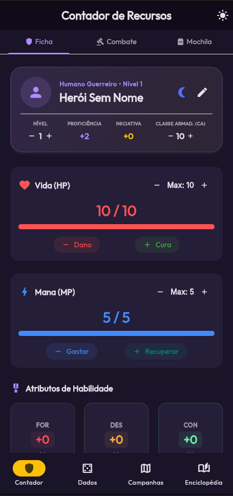
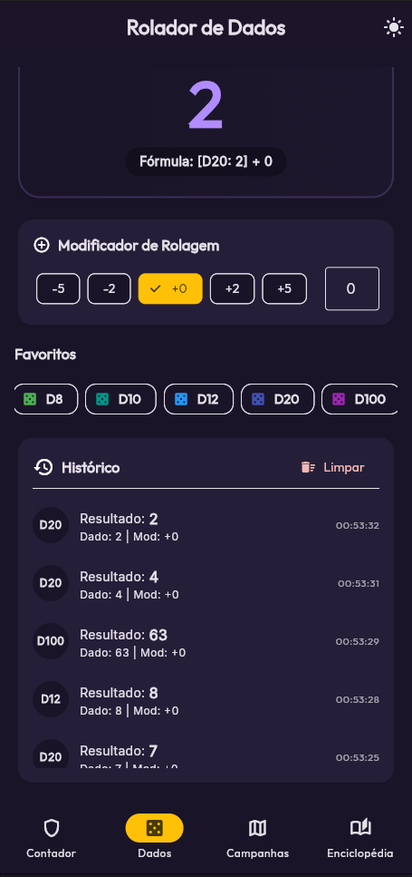
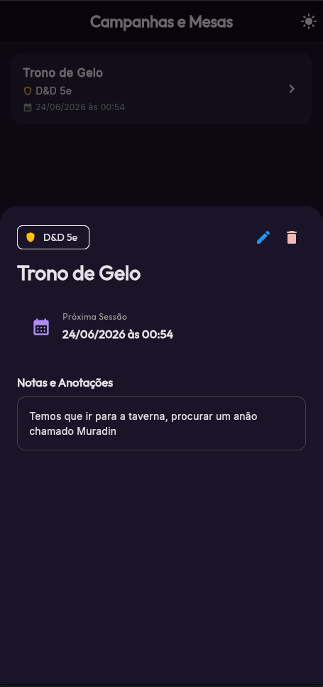
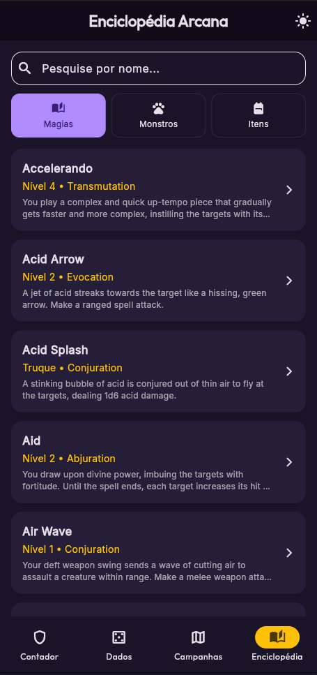
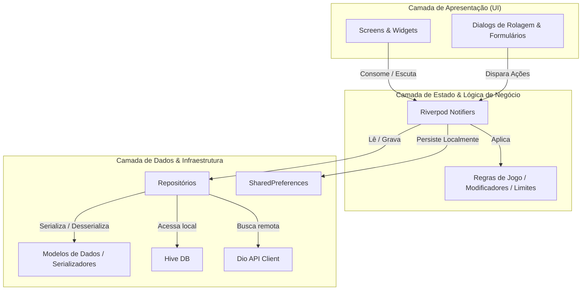

# RPG Companion App 🎲
**🌐 Demonstração em Produção:** [Acessar Companion App](https://gb-franca.github.io/Companion-App/)

> Centralizando a magia do RPG de mesa diretamente na palma da sua mão.

---

## 📱 Telas do Aplicativo

<p align="center">
  
  
  
  
  
</p>

---

## 📖 A Origem do Projeto: Do Caos do Papel ao Celular

Tudo começou em uma mesa clássica de RPG de sexta-feira à noite. 

Lá estava eu, equilibrando uma ficha de papel amassada (e com várias marcas de borracha que quase rasgavam a folha), um estojo cheio de dados que insistiam em cair da mesa, um caderno de anotações desorganizado e três manuais de regras de 400 páginas que pesavam metade da minha mochila. Quando chegou a minha vez no combate, levei minutos procurando a fórmula do feitiço no livro, somando bônus no papel de rascunho e caçando o dado de 12 faces que tinha rolado para debaixo do sofá.

Foi ali que pensei: *“Por que toda essa informação precisa estar espalhada e confusa se eu posso centralizar tudo no meu celular?”*

Assim nasceu o **RPG Companion App**. Um aplicativo desenvolvido para substituir a papelada cansativa e os manuais pesados por uma interface fluida, rápida e inteligente. Agora, com apenas um toque, eu posso consultar regras oficiais de monstros e magias, gerenciar meu inventário com cálculo automático de carga, rolar múltiplos dados com fórmulas complexas e controlar meus pontos de vida e mana sem riscar folhas de papel. Tudo limpo, prático e ao alcance dos dedos.

---

## ✨ Principais Funcionalidades

### 🛡️ 1. Ficha de Personagem Avançada (Tab 1)
* **Atributos e Modificadores**: Cálculo automático de bônus baseados nas regras oficiais de D&D 5e.
* **Estatísticas Derivadas**: Bônus de Proficiência e Iniciativa atualizados dinamicamente com o nível.
* **Controle de Vida & Mana**: Contadores visuais dinâmicos com travas de segurança para evitar ultrapassar o limite máximo.
* **Descanso Longo**: Restauração completa de vida e recursos mágicos instantaneamente.
* **Perícias e Proficiências**: Painel interativo com as 18 perícias clássicas, barra de pesquisa rápida e rolagens d20 diretas.

### 🎒 2. Inventário & Capacidade de Carga (Tab 3)
* **Mochila Digital**: Cadastro de equipamentos e consumíveis com peso e quantidade.
* **Cálculo de Carga**: Monitoramento em tempo real do limite de peso carregado (`Força × 15 lbs`) com indicador visual de sobrecarga.
* **Tesouro**: Controle detalhado de moedas de Ouro (PO), Prata (PP) e Cobre (PC).

### ⚔️ 3. Combate e Ataques Rápidos (Tab 2)
* **Ações de Combate**: Cadastro de armas e magias personalizadas.
* **Ataque e Dano**: Botões rápidos integrados ao motor de dados para rolar testes de acerto ou rolagens de dano com multiplicadores de dados em um toque.
* **Destaques Críticos**: Alertas animados destacando Críticos (Natural 20) e Falhas Críticas (Natural 1).

### 🎲 4. Rolador de Dados Multiversal
* **Painel Dinâmico**: Rolador de dados clássicos (D4, D6, D8, D10, D12, D20, D100).
* **Fórmulas Avançadas**: Parser inteligente capaz de processar expressões complexas (ex: `2d6+4`, `1d8+1d6-2`).
* **Histórico**: Lista interativa com as últimas rolagens feitas na sessão.

### 📖 5. Enciclopédia Arcana
* **Busca Conectada**: Integração assíncrona com APIs de RPG públicas (Open5e) para pesquisar monstros, magias e itens.
* **Detalhes Completos**: Descrições de magias, blocos de estatísticas de criaturas e atributos de itens mágicos formatados para leitura em telas móveis.

### 🗺️ 6. Gerenciador de Campanhas
* **Campanhas (CRUD)**: Listagem e gerenciamento de sessões e mesas de jogo, com salvamento persistente.

---

## 🏗️ Arquitetura do Projeto e Estrutura de Pastas

O projeto adota uma abordagem **Feature-First** (baseada em módulos de funcionalidades) combinada com princípios de **Clean Architecture** (Arquitetura Limpa). Essa estrutura separa preocupações de infraestrutura da lógica de negócios central, facilitando a escalabilidade, manutenção e testes automatizados.

### 📁 Estrutura de Diretórios

```text
lib/
├── core/                       # Código compartilhado de infraestrutura e utilitários
│   ├── database/               # Inicialização e adaptadores do Hive NoSQL
│   ├── network/                # Cliente HTTP Dio configurado para APIs externas
│   ├── preferences/            # SharedPreferences, Tema Escuro e configurações
│   └── theme/                  # Definições visuais e paletas de cores do Material 3
│
└── features/                   # Módulos independentes por funcionalidade
    ├── campaigns/              # Gerenciador de Campanhas e Mesas de Jogo (CRUD)
    │   ├── campaign_model.dart
    │   ├── campaign_repository.dart
    │   ├── campaigns_provider.dart
    │   └── campaigns_screen.dart
    │
    ├── counter/                # Ficha de Personagem (HP, Mana, Atributos, Inventário, Perícias)
    │   ├── counter_provider.dart
    │   └── counter_screen.dart
    │
    ├── dice_roller/            # Rolador de dados e histórico de rolagens da sessão
    │   ├── dice_roller_provider.dart
    │   └── dice_roller_screen.dart
    │
    └── encyclopedia/           # Enciclopédia de busca de monstros, magias e itens
        ├── encyclopedia_model.dart
        ├── encyclopedia_repository.dart
        ├── encyclopedia_provider.dart
        └── encyclopedia_screen.dart
```

---

## 🛠️ Engenharia de Software: Camadas e Fluxo de Dados

A arquitetura de cada módulo é organizada em três camadas conceituais bem definidas:



### 1. Camada de Apresentação (Presentation)
* **Widgets e Telas**: Construídos de forma puramente declarativa com Flutter (Material 3). Telas como `CounterScreen` consomem estados expostos por provedores Riverpod (`ref.watch`).
* **Interações**: Clicar em botões ou disparar eventos de rolagem invoca métodos do Notifier correspondente (`ref.read(...notifier)`).

### 2. Camada de Gerenciamento de Estado e Domínio (Domain/State)
* **Notifier Pattern**: Implementado via `Notifier` e `AsyncNotifier` do Riverpod 3.0. É o cérebro que gerencia a reatividade do app de forma desacoplada dos Widgets.
* **Regras de Negócio**: Executa as operações do sistema RPG (ex: aplicação de proficiências, controle de limites máximos de vida/mana, cálculo de pesos acumulados no inventário e soma dos resultados de dados com seus modificadores).

### 3. Camada de Dados e Infraestrutura (Data)
* **Modelos (Models)**: Representações de entidades limpas (`InventoryItem`, `CharacterAttack`, `CampaignModel`, `EncyclopediaEntry`) equipadas com métodos de serialização (`toMap`, `fromMap`) e construtores de cópia imutáveis (`copyWith`).
* **Fontes de Dados (Data Sources)**:
  * **Remota**: `Dio` consome a API RESTful Open5e.
  * **Local - Tabelas**: `Hive` persistindo registros estruturados como campanhas e anotações de sessões.
  * **Local - Ficha**: `SharedPreferences` salvando o estado serializado da ficha de personagem de forma rápida e síncrona.
* **Repositórios**: Isolam a origem real dos dados da camada de negócios. Se as magias vierem de um arquivo JSON local amanhã ao invés da API remota, a lógica de UI permanece 100% inalterada.

---

## 🚀 Como Executar o Projeto

1. Certifique-se de ter o SDK do Flutter instalado na sua máquina.
2. Clone este repositório.
3. Instale as dependências executando:
   ```bash
   flutter pub get
   ```
4. Execute o aplicativo em modo de desenvolvimento:
   ```bash
   flutter run
   ```

### 🧪 Rodando os Testes

Para garantir que toda a lógica do rolador de dados e os cálculos da ficha de personagem permaneçam íntegros, execute a suíte de testes:
```bash
flutter test
```
